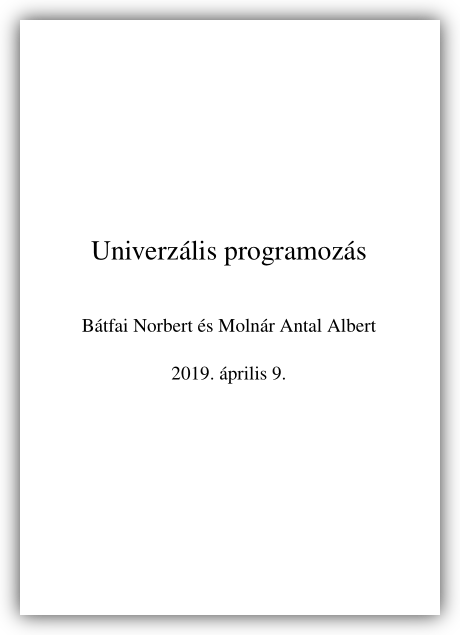
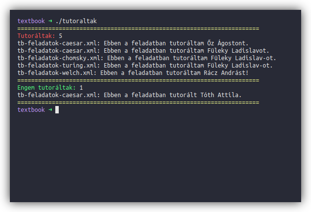

# 📚 textbook

[](https://travis-ci.org/krook1024/textbook)

<p align="center">
  
</p>

## Letöltés

A könyv pdf változata minden commit alkalmával frissül és letölthető a következő linken:  
[⬇ Letöltés](https://github.com/krook1024/textbook/releases)

## Fordítás

<details>
<summary>Kattints a kinyitáshoz</summary>

- Ubuntu:
```bash
sudo apt install -y docbook docbook-xml docbook-xsl xsltproc build-essential dblatex graphviz texlive-lang-european
make
```

- Arch Linux:
```bash
sudo pacman -Sy --needed --noconfirm dblatex graphviz texlive-langextra texlive-science docbook-xsl docbook-xml
make
```

</details>

## Tutorálások / tutoráltak számolása

<p align="center">
	
</p>

*Forkolva innen: https://gitlab.com/nbatfai/bhax/tree/master/thematic_tutorials/bhax_textbook (@0f1de1ee)*
